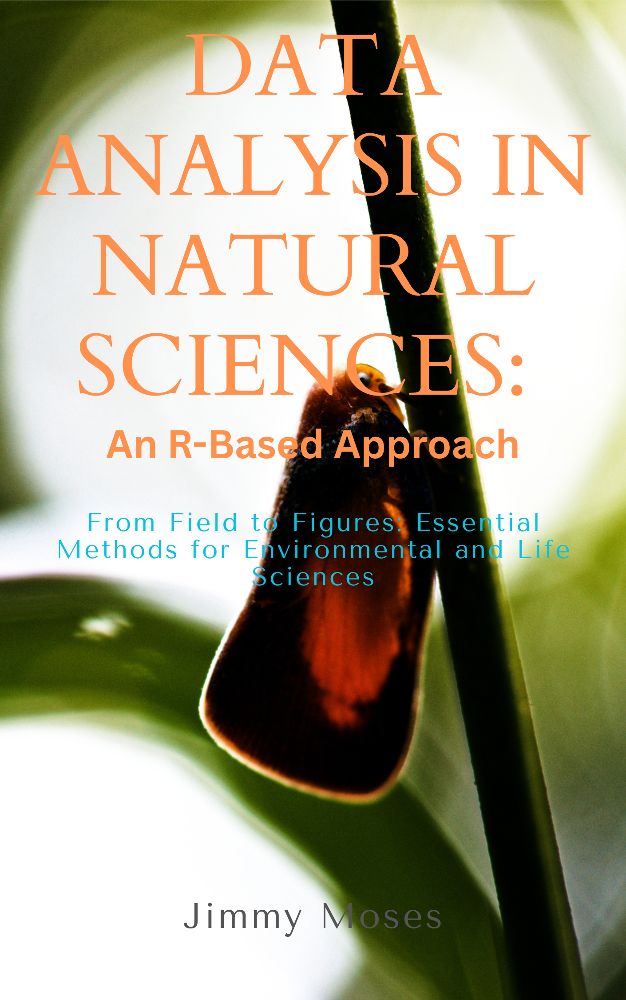

{fig-align="center" width="100%"}

::: {.content-block}

## Welcome {.unnumbered}

Welcome to **Data Analysis in Natural Sciences: An R-Based Approach**, a comprehensive, practical guide designed for students, professionals, and researchers across the natural sciences. This book provides hands-on methods for analyzing and visualizing data using R, with real-world applications spanning ecology, forestry, agriculture, marine biology, environmental science, and beyond.

::: {.callout-note appearance="simple" icon=false}
## 📘 About This Book

This is an **open-access online textbook** that teaches modern data analysis techniques using the R programming language. Whether you're a beginner learning R for the first time or an experienced researcher looking to adopt tidyverse workflows, this book offers practical guidance with reproducible code examples.
:::

## What You'll Learn {.unnumbered}

::: {.grid}

::: {.g-col-12 .g-col-md-6}
### 📊 Data Analysis Fundamentals
- Import, clean, and transform data
- Exploratory data analysis techniques
- Working with the tidyverse ecosystem
:::

::: {.g-col-12 .g-col-md-6}
### 📈 Statistical Methods
- Hypothesis testing frameworks
- Parametric and non-parametric tests
- Regression analysis with tidymodels
:::

::: {.g-col-12 .g-col-md-6}
### 🎨 Data Visualization
- Publication-quality graphics with ggplot2
- Interactive visualizations
- Effective scientific communication
:::

::: {.g-col-12 .g-col-md-6}
### 🌍 Real-World Applications
- Conservation case studies
- Environmental data analysis
- Reproducible research practices
:::

:::

## Book Structure {.unnumbered}

| Part | Chapters | Topics |
|------|----------|--------|
| **Getting Started** | 1-2 | Introduction to R, data structures, importing data |
| **Data Analysis Fundamentals** | 3-5 | EDA, hypothesis testing, statistical tests |
| **Data Visualization** | 6-7 | ggplot2, advanced graphics, interactive plots |
| **Advanced Topics** | 8-10 | Regression analysis, advanced modeling, conservation applications |
| **R in Context** | 11 | Integrations with jamovi, JASP, Positron, Jupyter, reticulate, plumber |

## Who Is This Book For? {.unnumbered}

This book is designed for anyone working with data in the natural sciences:

- 🎓 **Students**: Undergraduate and postgraduate students in biology, ecology, forestry, agriculture, and environmental sciences
- 🔬 **Researchers**: Scientists seeking to enhance their data analysis and visualization skills
- 🌿 **Practitioners**: Conservation professionals, environmental consultants, and natural resource managers
- 📊 **Data Enthusiasts**: Anyone interested in learning R for scientific data analysis

::: {.callout-tip}
## Getting Started

New to R? Start with [Chapter 1: Introduction to Data Analysis](chapters/01-introduction.qmd) for installation instructions and your first steps with R and RStudio.
:::

## Features {.unnumbered}

✅ **Complete code examples**: All code is fully reproducible
✅ **Real datasets**: Learn with actual data from ecological and environmental research
✅ **Modern R practices**: Tidyverse and tidymodels workflows throughout
✅ **Professional tips**: Best practices from experienced researchers
✅ **Exercises**: Practice problems to reinforce learning
✅ **Open access**: Free to read online

## About the Author {.unnumbered}

**Jimmy Moses** is a Papua New Guinean entomologist and lecturer at the Papua New Guinea University of Technology's School of Forestry. He specializes in ant ecology, biostatistics, and geospatial analysis, with a Ph.D. in Entomology from the University of South Bohemia (2021).

His research combines ecological field studies with modern analytical approaches, resulting in publications in journals including *Global Ecology and Biogeography* and *Proceedings of the Royal Society B*. His passion for making complex analytical methods accessible drives both his teaching and this book.

## How to Use This Book {.unnumbered}

::: {.grid}

::: {.g-col-12 .g-col-md-4}
### 📖 Read Online
Browse chapters directly in your web browser. Use the navigation menu to move between sections.
:::

::: {.g-col-12 .g-col-md-4}
### 💻 Run the Code
Copy code examples into R or RStudio. All code is designed to be reproducible with the included datasets.
:::

::: {.g-col-12 .g-col-md-4}
### 🔧 Adapt & Apply
Modify examples for your own data and research questions. The techniques are broadly applicable.
:::

:::

## Prerequisites {.unnumbered}

To get the most out of this book, you should have:

- Basic computer skills
- R and RStudio installed (instructions in Chapter 1)
- Curiosity about data and natural sciences!

*No prior programming experience is required.* I start from the basics and build up progressively.

## A note on the example datasets {.unnumbered}

The book ships with ten dataset directories named after scientific disciplines (`forestry/`, `epidemiology/`, `marine/`, and so on). Most of these CSV files came from public TidyTuesday-style sources and kept their original schemas. The directory names reflect the chapter context in which each file is used, not always what the file literally contains. For example, `forestry/forest_inventory.csv` is actually a Star Wars character table that we treat as a stand-in for continuous-variable analysis.

This is documented in full at [`data/MISMATCHES.md`](https://github.com/jm0535/dains/blob/main/data/MISMATCHES.md). When you reach a chapter exercise that asks you to load one of these files, glance at `names(df)` and the first few rows before assuming the variables match the directory name. If you have a real domain dataset you'd like to swap in, the code in each chapter is small enough to adapt.

## Get Involved {.unnumbered}

::: {.grid}

::: {.g-col-12 .g-col-md-6}
### 🐛 Found an Issue?
Report errors or suggest improvements on [GitHub Issues](https://github.com/jm0535/dains/issues)
:::

::: {.g-col-12 .g-col-md-6}
### 🤝 Want to Contribute?
Contributions welcome! See our [Contributing Guide](https://github.com/jm0535/dains/blob/main/CONTRIBUTING.md)
:::

:::

## Acknowledgments {.unnumbered}

This book would not be possible without:

- The **R Core Team** and the incredible R community
- The **tidyverse** and **tidymodels** teams for transforming how I work with data
- **RStudio/Posit** for excellent development tools
- The **Quarto** team for this beautiful publishing system
- All the **data providers** whose open datasets make the examples possible
- **Students and colleagues** who provided feedback and inspiration

---

::: {.text-center}
**Ready to start your data analysis journey?**

[Begin with Chapter 1 →](chapters/01-introduction.qmd){.btn .btn-primary .btn-lg}

:::

:::
